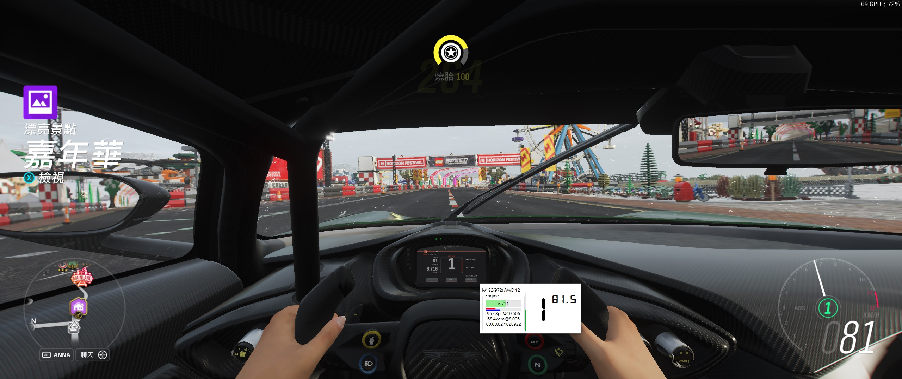

# Chesham.Forza

This C# project provides a data presentation of Forza telemetry. It's showing the car's class, drivetrain, numbers of cylinders, RPM, RPM of maxmium power/torque and the time of 0-100 km/hr. Also, the throttle, brake, gear and speed in km/hr is shown on the right. The window will always on top when the checkbox is checked and the game is on racing and it can be drag to where you want.

## Screenshots

